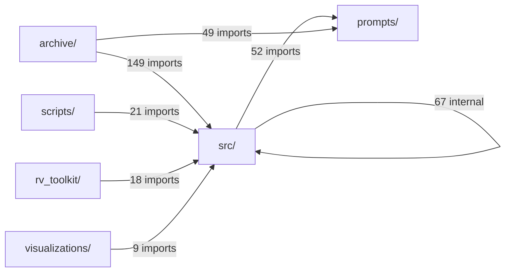

# Phase 1.2: Python Module Dependency Mapping - Complete Analysis

## Executive Summary

This analysis maps all Python imports across **351 files** in the mech-interp-latent-lab-phase1 project to understand code coupling and interdependencies.

### Key Metrics

| Metric | Value |
|--------|-------|
| **Total Python Files** | 351 |
| **Files with Internal Dependencies** | 201 (57%) |
| **Files with External Dependencies** | 276 (79%) |
| **Total Internal Dependencies** | 687 |
| **Total External Dependencies** | 979 |
| **Circular Dependencies** | 6 (self-references) |

---

## Directory Structure & Organization

### File Distribution

```
archive/                  133 files (38%)   - Legacy/deprecated code
src/                       89 files (25%)   - Core implementation
rv_toolkit/                48 files (14%)   - Reusable toolkit package
scripts/                   26 files (7%)    - Orchestration scripts
visualizations/            15 files (4%)    - Visualization code
REUSABLE_PROMPT_BANK/       9 files (3%)    - Prompt definitions
models/                     6 files (2%)    - Model-specific analysis
CANONICAL_CODE/             3 files (1%)    - Validated reference code
mcp_monitor/                3 files (1%)    - Monitoring infrastructure
experiments/                2 files (1%)    - Experiment definitions
prompts/                    2 files (1%)    - Prompt loader
utils/                      2 files (1%)    - Utilities
[root-level files]         11 files (3%)    - Various experiment scripts
```

---

## External Dependencies

### ML/AI Stack (Core Dependencies)

| Package | Files Using | Usage Pattern |
|---------|-------------|---------------|
| **torch** | 220 (63%) | Deep learning framework |
| **numpy** | 191 (54%) | Numerical computing |
| **pandas** | 162 (46%) | Data manipulation |
| **transformers** | 118 (34%) | HuggingFace models |
| **tqdm** | 101 (29%) | Progress bars |
| **scipy** | 68 (19%) | Scientific computing |

### Visualization & Analysis

| Package | Files Using | Purpose |
|---------|-------------|---------|
| matplotlib | 17 | Plotting |
| manim | 12 | Mathematical animations |
| seaborn | 8 | Statistical visualization |
| sklearn | 3 | Machine learning utilities |

---

## Internal Dependency Graph

### Core Architecture Layers

```
┌─────────────────────────────────────────────────────────────┐
│  LAYER 4: Scripts & Experiments                             │
│  ├── scripts/ (26 files)                                    │
│  ├── archive/scripts/ (133 files)                           │
│  └── rv_toolkit/experiments/                              │
├─────────────────────────────────────────────────────────────┤
│  LAYER 3: Pipelines & Orchestration                         │
│  ├── src.pipelines.registry (central hub)                   │
│  ├── src.pipelines.canonical/                               │
│  ├── src.pipelines.discovery/                               │
│  └── src.pipelines.archive/                                 │
├─────────────────────────────────────────────────────────────┤
│  LAYER 2: Metrics & Evaluation                              │
│  ├── src.metrics.rv (75 deps)                               │
│  ├── src.metrics.behavior_strict (21 deps)                  │
│  ├── src.metrics.baseline_suite                             │
│  ├── src.metrics.mode_score                                 │
│  └── src.metrics.logit_lens                                 │
├─────────────────────────────────────────────────────────────┤
│  LAYER 1: Core Infrastructure                               │
│  ├── src.core.models (99 deps) ← FOUNDATION                │
│  ├── src.core.hooks (22 deps)                               │
│  ├── src.core.patching (24 deps)                            │
│  ├── src.core.head_specific_patching (12 deps)              │
│  └── src.core.utils                                         │
├─────────────────────────────────────────────────────────────┤
│  LAYER 0: External Dependencies                             │
│  ├── torch, transformers, numpy, pandas                     │
│  └── tqdm, scipy                                            │
└─────────────────────────────────────────────────────────────┘
```

### Cross-Directory Dependency Flow



---

## High-Coupling Analysis

### Most Depended-Upon Modules (High Fan-In)

| Module | Incoming Dependencies | Role |
|--------|----------------------|------|
| **prompts.loader** | 103 | Universal prompt loading interface |
| **src.core.models** | 99 | Model loading and management |
| **src.metrics.rv** | 75 | Recursive value metric |
| **src.pipelines.registry** | 58 | Pipeline registration hub |
| **src.core.patching** | 24 | Activation patching utilities |
| **src.core.hooks** | 22 | Transformer hooks |
| **src.utils.run_metadata** | 21 | Metadata tracking |
| **src.metrics.behavior_strict** | 21 | Behavioral metrics |

### Modules with Many Dependencies (High Fan-Out)

| Module | Outgoing Dependencies | Role |
|--------|----------------------|------|
| **src.pipelines.registry** | 47 | God module - imports all pipelines |
| **src.pipelines.archive.ioi_causal_test** | 9 | Complex experiment |
| **src.pipelines.archive.retrocompute_mode_score** | 9 | Analysis pipeline |
| **src.pipelines.discovery.c2_rv_measurement** | 9 | Measurement pipeline |
| **src.pipelines.archive.geometry_behavior** | 8 | Geometry analysis |

---

## Circular Dependencies

**6 self-referential imports detected** - These are likely relative imports within packages, not problematic cycles:

1. `archive.scripts.NOV_16_Mixtral_free_play` → itself
2. `REUSABLE_PROMPT_BANK` → itself
3. `src.core.model_physics` → itself
4. `src.metrics.baseline_suite` → itself
5. `archive.scripts.mistral_patching_FINAL` → itself
6. `archive.scripts.test_ssh_paramiko` → itself

**Assessment**: These appear to be package-level relative imports (e.g., `from . import module`) and are **not architectural problems**.

---

## Code Coupling Assessment

### Tight Coupling Areas

#### 1. **src.pipelines.registry - The God Module**
- Imports **47 pipeline modules** directly
- Acts as a central registry for all experiments
- Any change to any pipeline requires registry updates
- **Risk**: High - single point of failure

#### 2. **archive/ → src/ Dependency**
- 149 imports from `archive/` scripts to `src/` modules
- Legacy code heavily depends on core modules
- **Risk**: Medium - makes core refactoring difficult

#### 3. **Universal Prompt Loader**
- `prompts.loader` used by 103 files
- Centralized prompt management
- **Risk**: Low - this is appropriate centralization

#### 4. **Core Model Dependency**
- `src.core.models` used by 99 files
- Foundation for all model operations
- **Risk**: Low - expected for core infrastructure

### Dependency Duplication

**rv_toolkit/ vs src/ Overlap:**
- `rv_toolkit.rv_toolkit.metrics` appears to duplicate `src.metrics`
- `rv_toolkit.rv_toolkit.patching` may overlap with `src.core.patching`
- **Recommendation**: Consolidate to avoid maintenance burden

---

## Architecture Recommendations

### 1. Break Down the Registry

**Current**: `src.pipelines.registry` imports 47 modules
**Recommended**: Split into domain-specific registries

```python
# Instead of one giant registry:
src.pipelines.registry
  ├── discovery_registry.py  # Discovery experiments
  ├── canonical_registry.py  # Canonical tests
  └── archive_registry.py    # Legacy experiments
```

### 2. Define Interface Boundaries

**Create clear contracts between layers:**

```python
# src/core/interfaces.py - Stable APIs
class ModelInterface:
    """Contract for model operations"""
    pass

class MetricInterface:
    """Contract for metrics"""
    pass
```

### 3. Consolidate Toolkit

**Option A**: Merge `rv_toolkit/` into `src/`
**Option B**: Make `rv_toolkit/` the official public API, internalize `src/`

### 4. Add Dependency Constraints

**Use import-linter or similar to enforce:**
- `archive/` cannot import from `src/pipelines/` (only `src/core/` and `src/metrics/`)
- `rv_toolkit/` should not depend on `src/pipelines/archive/`

---

## Visualization Files Generated

1. **DEPENDENCY_REPORT.md** - Full markdown report
2. **DEPENDENCY_SUMMARY.json** - Machine-readable summary
3. **dependency_analysis.json** - Complete dependency data
4. **dependency_graph_simple.dot** - Simplified DOT graph
5. **dependency_graph_detailed.dot** - Detailed DOT graph

To generate PNG visualizations:
```bash
dot -Tpng dependency_graph_simple.dot -o dependency_graph_simple.png
dot -Tpng dependency_graph_detailed.dot -o dependency_graph_detailed.png
```

---

## Appendix: Module Import Statistics

### Standard Library Usage

| Module | Files Using | Common Use Case |
|--------|-------------|-----------------|
| pathlib | 150 | File path handling |
| json | 146 | Data serialization |
| typing | 139 | Type hints |
| sys | 129 | System operations |
| os | 80 | OS interactions |
| datetime | 78 | Timestamp handling |

### External Package Categories

**Deep Learning**: torch, transformers
**Data**: numpy, pandas, scipy
**Visualization**: matplotlib, seaborn, plotly, manim
**Progress**: tqdm
**Utilities**: requests, yaml

---

*Analysis generated: 2026-02-05*
*Total analysis time: ~2 minutes*
