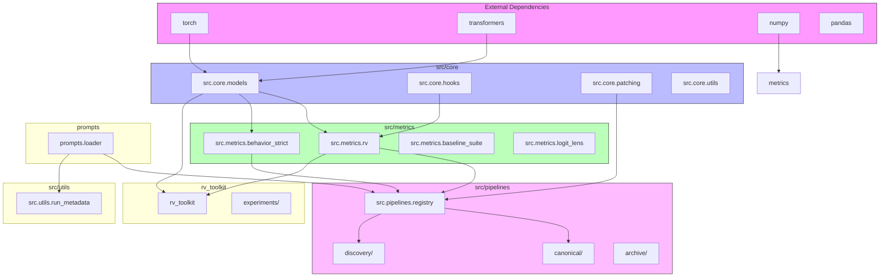

# Python Module Dependency Analysis Report

## Executive Summary

| Metric | Value |
|--------|-------|
| Total Python Files | 351 |
| Files with Internal Dependencies | 201 |
| Files with External Dependencies | 276 |
| Total Internal Dependencies | 687 |
| Total External Dependencies | 979 |
| Total Standard Library Dependencies | 974 |
| Circular Dependencies Found | 6 |

## Directory Structure

### File Distribution by Directory

- **archive**: 133 files
- **src**: 89 files
- **rv_toolkit**: 48 files
- **scripts**: 26 files
- **visualizations**: 15 files
- **REUSABLE_PROMPT_BANK**: 9 files
- **models**: 6 files
- **CANONICAL_CODE**: 3 files
- **mcp_monitor**: 3 files
- **experiments**: 2 files
- **prompts**: 2 files
- **utils**: 2 files
- **RECOVERED_GOLD**: 1 files
- **R_V_PAPER**: 1 files
- **gemma_behavioral_transfer.py**: 1 files
- **gemma_causal_batch_kv_only.py**: 1 files
- **gemma_full_validation_v2.py**: 1 files
- **gemma_kv_vs_vproj_comparison.py**: 1 files
- **gemma_roman_empire_deep_dive.py**: 1 files
- **gemma_rv_bifurcation_threshold.py**: 1 files
- **gemma_rv_during_generation.py**: 1 files
- **gemma_rv_trajectory_source.py**: 1 files
- **neurips_n300_robust_experiment.py**: 1 files
- **openclaw_quickstart.py**: 1 files
- **reproduce_results.py**: 1 files

## External Package Dependencies

### Top 15 Most Used External Packages

| Package | Files Using It |
|---------|----------------|
| torch | 220 |
| numpy | 191 |
| pandas | 162 |
| transformers | 118 |
| tqdm | 101 |
| __future__ | 70 |
| scipy | 68 |
| matplotlib | 17 |
| manim | 12 |
| seaborn | 8 |
| pytest | 5 |
| sklearn | 3 |
| requests | 2 |
| common | 1 |
| PIL | 1 |

## Standard Library Dependencies

### Top 15 Most Used Standard Library Modules

| Module | Files Using It |
|--------|----------------|
| pathlib | 150 |
| json | 146 |
| typing | 139 |
| sys | 129 |
| os | 80 |
| datetime | 78 |
| contextlib | 55 |
| dataclasses | 30 |
| argparse | 23 |
| traceback | 23 |
| re | 21 |
| csv | 16 |
| warnings | 14 |
| random | 12 |
| collections | 10 |

## Cross-Directory Dependencies

This shows which directories import from which other directories.

| Source Directory | Target Directory | Count |
|------------------|------------------|-------|
| archive | src | 149 |
| src |  | 67 |
| src | prompts | 52 |
| archive | prompts | 49 |
| scripts | src | 21 |
| rv_toolkit | src | 18 |
| REUSABLE_PROMPT_BANK |  | 11 |
| rv_toolkit |  | 9 |
| visualizations | src | 9 |
| archive | REUSABLE_PROMPT_BANK | 8 |
| visualizations |  | 6 |
| archive | CANONICAL_CODE | 2 |
| mcp_monitor |  | 1 |
| neurips_n300_robust_experiment.py | archive | 1 |
| neurips_n300_robust_experiment.py | REUSABLE_PROMPT_BANK | 1 |
| prompts |  | 1 |
| reproduce_results.py | src | 1 |
| rv_toolkit | prompts | 1 |
| rv_toolkit | CANONICAL_CODE | 1 |
| scripts | archive | 1 |
| scripts | mcp_monitor | 1 |
| scripts | prompts | 1 |

## Core Module Analysis

### Most Depended-Upon Internal Modules

| Module | Incoming Dependencies |
|--------|----------------------|
| prompts.loader | 103 |
| src.core.models | 99 |
| src.metrics.rv | 75 |
| src.pipelines.registry | 58 |
| src.core.patching | 24 |
| src.core.hooks | 22 |
| src.utils.run_metadata | 21 |
| src.metrics.behavior_strict | 21 |
| archive.scripts.kitchen_sink_prompts | 20 |
| src.metrics.behavior_states | 15 |
| src.metrics.mode_score | 13 |
| src.core.head_specific_patching | 12 |
| REUSABLE_PROMPT_BANK | 11 |
| src.pipelines.archive.steering | 11 |
| src.pipelines.archive.surgical_sweep | 7 |
| CANONICAL_CODE.n300_mistral_test_prompt_bank | 4 |
| src.steering.activation_patching | 4 |
| src.pipelines.c2_rv_measurement | 4 |
| src.pipelines.mlp_ablation_necessity | 4 |
| src.pipelines.mlp_combined_sufficiency_test | 4 |

## Circular Dependencies

The following self-referential imports were detected (likely from relative imports within packages):

- `archive.scripts.NOV_16_Mixtral_free_play -> archive.scripts.NOV_16_Mixtral_free_play`
- `REUSABLE_PROMPT_BANK -> REUSABLE_PROMPT_BANK`
- `src.core.model_physics -> src.core.model_physics`
- `src.metrics.baseline_suite -> src.metrics.baseline_suite`
- `archive.scripts.mistral_patching_FINAL -> archive.scripts.mistral_patching_FINAL`
- `archive.scripts.test_ssh_paramiko -> archive.scripts.test_ssh_paramiko`

## Key Module Ecosystems

### src/ Core Modules
The `src/` directory contains the core implementation:
- **src.core**: Low-level model interaction, patching, hooks
- **src.metrics**: Evaluation metrics (RV, behavior states, logit lens)
- **src.pipelines**: Experiment pipelines and registries
- **src.steering**: Activation patching and KV cache manipulation
- **src.utils**: Utility functions and metadata handling

### rv_toolkit/ Reusable Toolkit
The `rv_toolkit/` directory provides a reusable package:
- **rv_toolkit.core**: Core toolkit functionality
- **rv_toolkit.experiments**: Experiment implementations
- **rv_toolkit.validation**: Validation and testing code
- **rv_toolkit.tests**: Unit tests

### scripts/ Orchestration
The `scripts/` directory contains top-level orchestration scripts.

## Dependency Coupling Analysis

### Tight Coupling Areas
1. **src.pipelines.registry** is the central hub importing most pipeline modules
2. **src.metrics.rv** is widely used across many modules
3. **src.core.models** is a foundational dependency
4. **prompts.loader** is used across many experiment scripts

### Recommended Refactoring
1. Consider breaking down `src.pipelines.registry` into smaller registry modules
2. Evaluate if `archive/` scripts should depend on `src/` core modules
3. The `rv_toolkit/` appears to duplicate some `src/` functionality

## Dependency Visualization

